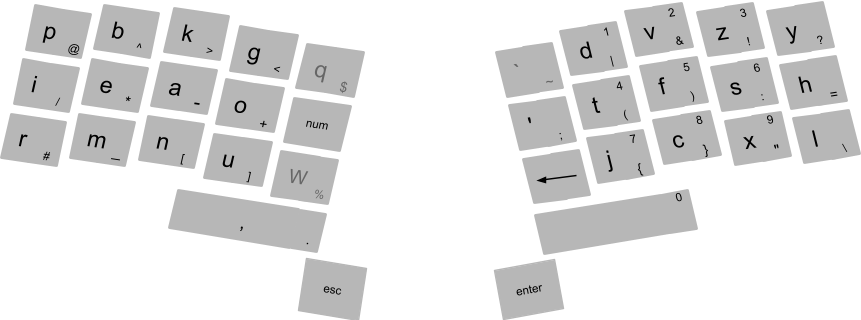
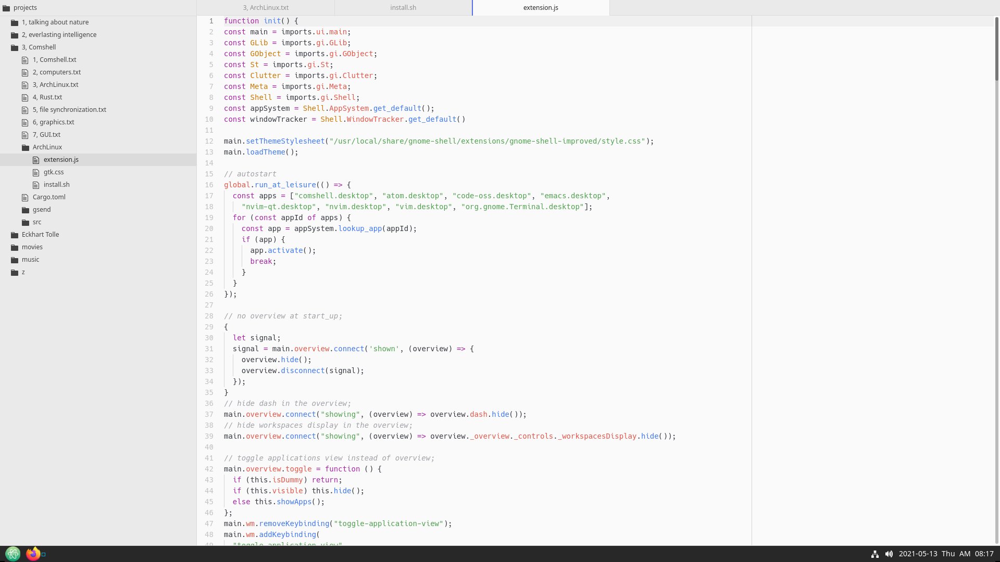

<pre><code><h1>Comshell</h1>
<h2>1, Comshell</h2><b>command based user interface</b>
command based user interfaces (using keyboard, voice, gesture) are
  faster, more convenient and more powerful,
  than pointer based user interfaces (using mouse, touch, pen)
pointer based interface seems appealing at first sight, because of its discoverability;
but with simple uniform GUI (ie the oposite of what we see in websites),
  there is no need for a pointer based user interface;

touch interface has an additional problem: interaction at a distance is not possible;
but it can still be useful in simple or special applications;

detection of voice commands is a relatively simple process (compared to general speech recognition),
  because we only need to match against a relatively small set of commands;
a headset with near range microphone can be used, to exclude far away sound sources;
also it is better to put battery and transmitter of the headset in a separate unit,
  that can be put in the pocket;
  this makes the headset lighter and safer;

for those who neither can use all their fingers, nor can talk,
  gesture based (2d) input can be implemented;

, two commas -&gt; ";"
, comma followed by a letter -&gt; the symbol on its bottom right corner
, ";" followed by "psi" followed by space or comma -&gt; "ψ" followed by one space or nothing
, "_ab_c" then two underscores -&gt; AbC (followed by one space)
, "__ab_c" then two underscores -&gt; __ab_c__
<a href='https://github.com/adereth/dactyl-keyboard'>https://github.com/adereth/dactyl-keyboard</a>
Kinesis Advantage 2 keyboard
<a href='http://www.allthingsergo.com/the-best-ergonomic-mechanical-keyboards/'>http://www.allthingsergo.com/the-best-ergonomic-mechanical-keyboards/</a>

for compatibility with other applications, we may still need a mouse,
  and these extra keys which can be put in the middle of keyboard:
, arrow keys, "page up", "page down", "home", "end", "tab";
, "alt", "ctrl", "shift", "punctuations";
also we can have a row of function keys, plus the "delete" key, at the top;

<b>Comshell</b>
Comshell is a unified computing environment, utilizing command based user interface;

project directories reside in directories named "projects" or "projects.*",
  inside home directory or mounted disks;
list of all projects will appear in a floating layer, at the center of screen;
each group of projects (which are in the same directory) will be shown in separate tabs;

in a project view, list of files will be displayed in the left side_bar;
opened files are indicated by a line below them;
multiple views of a file are indicated by sections in this line;
files and directories with names starting with a dot, will be hidden;
".cache" directory inside a project is for files we don't want to share or backup;

text files will be opened in a text editor;
directories with ".g" suffixes, will be opened in a gallery view;
files and directories inside a gallery, will be opened in a floating layer;

non_local projects, web pages, PDF documents, etc,
  accessed from links inside the main project, will be opened in a floating layer;
web pages:
, move caret between visual objects (ignoring structural objects);
, or use hinting for text input and other widgets, text and other elements like images and videos;

modal key_bindings;
modes (normal mode and insert mode) must be visually distinctive;
press "esc" or "tab" to go to normal mode;
in normal mode we can:
, press "enter" to go to insert mode;
, move the cursor to the next or previous word;
, move the cursor to the next or previous lines or table cells;
, move the cursor to the next or previous paragraph;
, start and end selection, then copy or cut;
, paste
, undo
, find

, navigation: move, search
, selection
, completion

double space:
, at the beginning of line: indent
, otherwise: complete (auto_completion does not disappear with only one space)

<h2>2, computers</h2><b>asynchronous digital circuits</b>
in conventional digital circuits when the inputs change,
  the outputs can have temporary invalid values, until they stabilize to the valid values;
but for the circuit to do its job,
  gates with memory (registers) must operate only when the inputs have correct values;
one solution is to synchronize registers with a global clock signal;
  the period of clock signal is made long enough for the circuit to become stable;

disadvantages of synchronous circuits:
, we have to split long operations into several smaller ones,
  which can be performed in successive clock cycles (a technique known as pipelining);
  otherwise the circuit would be slow and inefficient;
, distributing a high_fan_out, timing_sensitive clock signal can be complicated;
, electromagnetic interference at the clock frequency and its harmonics;
, widely distributed clock signal takes a lot of power,
  and must run whether the circuit is receiving inputs or not;
although "clock gating" can help to reduce some of the problems of synchronous circuits,
 i think the real solution is to use asynchronous circuits;

the only sane kind of asynchronous circuit which i could imagine is this:
, next to any data wire there is a control wire which determines if the data is valid or not;
, when a register wants to change its outputs, it first invalidates them,
  for a duration equal to the delay of one gate;
, any gate receiving an invalid input, invalidates its outputs;
, this way all data which is going to change in the future, is first invalidated;
, registers operate only when all inputs are valid;

<b>computers</b>
cpu, memory, peripherals,
  this seems to be the only practical architecture for the hardware of computers;
cpu runs a sequence of simple computations, called instruction codes, one by one;

compilers are special programs that generate instruction codes,
  from a program written in a structured and human readable language;

there is always possibility of backdoors for closed source CPU,
  especially if the boot firmware is also closed source;
recently introduction of "secure execution environment" makes this situation even worse;
it's a closed source, full_blown, always_running mini operating system,
  with full access to the whole system (including memory and network);
furthermore they have made it practically impossible for users to disable it;
this mess of a design cries out for hidden and quite sophisticated backdoors;
<a href='https://www.fsf.org/blogs/licensing/intel-me-and-why-we-should-get-rid-of-me'>https://www.fsf.org/blogs/licensing/intel-me-and-why-we-should-get-rid-of-me</a>
<a href='https://libreboot.org/faq.html#intel'>https://libreboot.org/faq.html#intel</a>
<a href='https://en.wikipedia.org/wiki/Intel_Management_Engine'>https://en.wikipedia.org/wiki/Intel_Management_Engine</a>
<a href='https://blog.invisiblethings.org/papers/2015/x86_harmful.pdf'>https://blog.invisiblethings.org/papers/2015/x86_harmful.pdf</a>

one read_only ROM, plus a writable ROM:
, no possibility of bricking the device;
, no need for complex signing mechanism to make sure a device's firmware is not malicious;
  just clear the writable flash when you buy a device;

on X86 architecture we can have open source boot_loader, and GPU drivers,
  using Intel with Coreboot+Grub2 for example;
  <a href='https://www.coreboot.org/GRUB2#Scanning_for_grub.cfg_on_local_hard_drives'>https://www.coreboot.org/GRUB2#Scanning_for_grub.cfg_on_local_hard_drives</a>
  though there sill will be closed source parts (Intel FSP);
but there is no easy way to get rid of Intel ME (or AMD PSP);
though there are some hacks for disabling (but not completely remove) Intel ME:
  <a href='https://puri.sm/posts/deep-dive-into-intel-me-disablement/'>https://puri.sm/posts/deep-dive-into-intel-me-disablement/</a>

ARM architecture is closed source too, but we can have open source GPU driver (Qualcomm/Adreno),
  and Coreboot+Grub2 bootloader;
ARM TrustZone can host an open source operating system too, apparently;
<a href='https://news.ycombinator.com/item?id=17783357'>https://news.ycombinator.com/item?id=17783357</a>

open source CPU:
, RISC_V: no adequate hardware available yet;
, PowerPc: no adequate hardware available yet;
, MIPS: bad old design (relative to other alternatives, not X86),
  no suitable hardware available yet;

programs usually do not run directly on computer hardware;
instead they run on a more sophisticated software machine (a virtual machine) called the kernel;
in theory we can live without a kernel (an idea sometimes called a library operating system);
but in that case, we have to rewrite all the required libraries, on bare metal;
anyway, having an operating system, makes developing and testing new programs much easier;

Linux is a highly developed, constantly evolving, open_source kernel;
in Linux (and other Unix based operating systems) most things appear in the file system;
i think the reason is to make it possible to do lots of things using shell scripts,
  instead of a proper programming language;
while i can understand the convenience it provides, i don't think it's good design;

<h2>3, ArchLinux</h2>using Arch Linux we can easily setup and maintain a Linux system;
the following shows how to setup a basic graphical environment, using GnomeShell;

in the installed system, there is only one application, a terminal emulator;
other applications can be installed using "pacman";
you can press "alt-space" to show the list of applications;
selecting an application from the list shows it in a dedicated workspace;
also you can power off, reboot, logout, suspend, or lock the system,
  from the applications list, just by typing those commands;
press "alt-enter" to open a terminal window;
press "alt-esc" to close the focused window;
press "alt-tab" to switch between recent workspaces;
press "alt-a" to switch between the windows of a workspace;
press "alt-shift-space" to toggle maximized state;
press "alt-shift-s" or "alt-shift-r" to take a screen_shot or record a screen_cast;

boot Arch Linux live environment;
to ensure the system clock is accurate:
; timedatectl set-ntp true
if you need to connect to a WIFI network:
; iwctl
  device list
  station &lt;device&gt; get-networks
  station &lt;device&gt; connect &lt;SSID&gt;

list available block devices using "lsblk", then on the intended block device,
  create the needed partitions, and finally format and mount them:
; printf "label: gpt\n,260MiB,U,*\n;" | sfdisk /dev/&lt;device&gt;
; mkfs.fat -F32 /dev/&lt;partition1&gt;; mkfs.btrfs /dev/&lt;partition2&gt;
; mount /dev/&lt;partition2&gt; /mnt
; mkdir -p /mnt/boot/efi
; mount /dev/&lt;partition1&gt; /mnt/boot/efi
; mkdir /mnt/etc
; genfstab -U /mnt &gt;&gt; /mnt/etc/fstab

;sh
pacstrap /mnt base
arch-chroot /mnt
curl https://damoonsaghian/Comshell/archive/master.tar.gz | tar -xz
cd Comshell/ArchLinux
;
ensure that the files aren't malicious, then:
; sh install.sh
; exit; reboot

to connect to a WIFI network:
; nmcli dev wifi
; nmcli --ask dev wifi con &lt;ssid&gt;
to disconnect from a WIFI network:
; nmcli con down id &lt;ssid&gt;

if your combined headset jack is not detected correctly, you can try this:
; pkexec echo 'options snd_hda_intel index=0 model=dell-headset-multi' &gt; /etc/modprobe.d/alsa-base.conf
<a href='https://wiki.archlinux.org/index.php/Advanced_Linux_Sound_Architecture#Correctly_detect_microphone_plugged_in_a_4-pin_3.5mm_(TRRS)_jack'>https://wiki.archlinux.org/index.php/Advanced_Linux_Sound_Architecture#Correctly_detect_microphone_plugged_in_a_4-pin_3.5mm_(TRRS)_jack</a>
this made the microphone available, but with a very bad static noise;
so maybe it's better to use a USB/Bluetooth sound card;

you can set "user1" for automatic login (using the root terminal):
; pkexec nano /etc/gdm/custom.conf
  [daemon]
  AutomaticLoginEnable=True
  AutomaticLogin=user1
but to protect the computer from physical attacks, you have to disable automatic login,
  and lock the session when you leave the computer;
in addition you have to:
, somehow prevent tampering with hardware;
, disable boot from USB (and other external ports);
, protect boot firmware by a password;
these can make physical attacks more difficult, but keep in mind that
  physical access to a computer is root access, given enough time and resources;

<b>system administration</b>
in system administration we must ensure that:
1, the command executed is explicitly given by the user;
2, if a program steals a "wheel" user's password, it can't change the system;

"sudo" fails in both cases;
<a href='https://www.reddit.com/r/linuxquestions/comments/8mlil7/whats_the_point_of_the_sudo_password_prompt_if/'>https://www.reddit.com/r/linuxquestions/comments/8mlil7/whats_the_point_of_the_sudo_password_prompt_if/</a>

"pkexec" is safer, but since the Polkit agent doesn't show command arguments,
  it can be vulnerable too;
further more, "pkexec" fails in the second case;
  a fake Polkit agent can be used to send the stolen password to Polkit;
and since Polkit admin is installed and active by default,
  we have to disable it to protect the system:
; mkdir -p /etc/polkit-1/rules.d
; echo 'polkit.addAdminRule(function(action, subject) { return []; });' &gt;
  /etc/polkit-1/rules.d/49-rootpw_global.rules

always use a different password for root; because "su" is always present in a Linux system,
  and since it fails in both cases, it can be used to take over the system;

the solution is a program which opens a Wayland window with a command prompt;
if you have given your command as arguments to the program,
  the prompt shows that command, as default input;
after pressing "return", it asks for the user's password (user must be in wheel group);

<b>automatic online atomic upgrades</b>
<a href='https://www.techrapid.uk/2017/04/automatically-update-arch-linux-with-systemd.html'>https://www.techrapid.uk/2017/04/automatically-update-arch-linux-with-systemd.html</a>
<a href='https://wiki.archlinux.org/index.php/Systemd/Timers'>https://wiki.archlinux.org/index.php/Systemd/Timers</a>

to have reliable automatic updates, they must be atomic;

"usr", "etc" and "boot" must be symlinks to subvolumes;
create a base directory;
create snapshots of "usr", "etc" and "boot", then mount them in the base directory;
for the rest of system root directories make symlinks in the base directory;
chroot and upgrade;
remove the base directory;
change the "usr", "etc" and "boot" symlinks in the system root,
  to point to the new snapshots;

<h2>4, Rust</h2>Rust makes bad programming hard, and good programming fun;
Rust does not hide inherent complexity, in fact it bolds it, so we can see it, and avoid it;
by inherent complexity i mean a complexity which can not be abstracted away completely;
  ie if we try to hide it, it will re_emerge somewhere else;
in fact, hiding inherent complexity usually leads to choosing the wrong approach;

sharing mutable data,
  ie having a mutable reference to some data, while it is shared using other references,
  is the root of many inherent complexities;
<a href='https://manishearth.github.io/blog/2015/05/17/the-problem-with-shared-mutability/'>https://manishearth.github.io/blog/2015/05/17/the-problem-with-shared-mutability/</a>
the basic problem in concurrent programming is sharing mutable data;

a data race happens when these three behaviors occur:
, two or more pointers access the same data at the same time;
, at least one of the pointers is being used to write to the data;
, there’s no mechanism being used to synchronize access to the data;

to prevent sharing mutable data, we can abandon mutability like in Haskell;
but since mutability is necessary any way, it introduces a complicated mechanism (Monads);

another approach to deal with concurrently shared mutable data, is the one used in Pony;
<a href='https://www.ponylang.io/'>https://www.ponylang.io/</a>
it doesn't abandon aliasing nor mutability,
  instead it controls them using reference capabilities;
Pony's approach introduces many complexities, especially when dealing with generics;

a better approach is done by Rust, a language which overall has a better design too;
this approach even allows Rust to limit reference counting,
  to situations where it's absolutely necessary;
Pony_like actors can be done in Rust using "may_actor";
<a href='https://crates.io/crates/may_actor'>https://crates.io/crates/may_actor</a>

, immutable data will be wrapped in "Arc", and we have direct access to it;
, mutable data will be wrapped in "Actor" and we can access it only through the actor itself;

async access: Rc
async access from multiple threads: Arc
async mutable access: Rc&lt;RefCell&gt;
async mutable access from mutiple threads: Actor

it's better to use "&mut" only for the receiver in methods;
and anywhere else use actors to control mutability;

static data (functions, structs, constants): no problem, copy or share by reference;
dynamic data:
, if data is small we usually put it on stack;
  so we don't share it across the program, we copy it;
, if data is big we put it on heap and make references to it;
  if data is immutable we just have to manage its lifetime,
    either statically (using "&"), or dynamically (using "Arc")
  but if data is mutable we have to check if the read_write_lock pattern is fulfilled,
    using "&mut" or "Actor";
  "Mutex" or "RwLock" check read_write_lock pattern at runtime,
    and make the program to panic, if it's failed;

in Rust any resource have exactly one owner which takes care of its resource deallocation;
owners can share their data by lending them to references;
references must have a lifetime less than the owner;
furthermore lifetime of a mutable reference must not overlap with other references;
<a href='http://blog.skylight.io/rust-means-never-having-to-close-a-socket/'>http://blog.skylight.io/rust-means-never-having-to-close-a-socket/</a>

owner can:
, access and mutate the resource;
, lend the resource to a reference;
, hand over ownership (move), or deallocate resource;
but during a lend, owner can't:
, mutate the resource;
, mutably lend resource to another reference;
, hand over ownership (move), or deallocate resource;
and during a mutable lend, owner can't even access the resource;

immutable (and thus sharable) references can:
, access borrowed resource;
, immutably lend resource to other references;
mutable (and thus exclusive) reference can:
, access and mutate resource;
, mutably lend resource to another reference;
, immutably lend resource, but during this lending, they can't mutate it;
  just like when an owner immutably lends its resource;

during shared borrow (immutable borrow) no one owns the data;
  so even the original owner can't change it;
during mutable borrow the (unique) borrower owns it;
so "&mut" is actually a temporary transfer of ownership;

s: String -&gt; &s: &String -&gt; &s[..]: &str
v: Vec&lt;T&gt; -&gt; &v: &Vec&lt;T&gt; -&gt; &v[..]: &[T]
&str and &[T] are slices; str and [T] are unsized types;
slicing is like borrowing from an unsized type;
since the slice contains the size, the lending type itself doesn't need to have a definite size;

x = a[i] -&gt; this is possible if the elements of "a" are copy
  (cause moving out of collections is not possible);
x = &a[i] -&gt; this is for the case when the elements are not copy;
x = a[i..j] -&gt; this is always invalid;
x = &a[i..j] -&gt; slicing;

auto ref/deref for self in method calls:
  compiler inserts as many * or & as necessary to get it right;
because in method calls name and context of a method call is almost always sufficient
  to infer the move/borrow semantics;

deref coercion:
, &T -&gt; &U when T: Deref&lt;Target=U&gt;
, &mut T -&gt; &U when T: Deref&lt;Target=U&gt;
, &mut T -&gt; &mut U when T: DerefMut&lt;Target=U&gt;
examples:
  &&i32 -&gt; &i32 because &i32: Deref&lt;Target=i32&gt;
  &String -&gt; &str because String: Deref&lt;Target=str&gt;
  &Vec&lt;T&gt; -&gt; &[T] because Vec&lt;T&gt;: Deref&lt;Target=[T]&gt;
  &Arc&lt;T&gt; -&gt; &T because Arc&lt;T&gt;: Deref&lt;Target=T&gt;
<a href='https://github.com/rust-lang/rfcs/blob/master/text/0241-deref-conversions.md'>https://github.com/rust-lang/rfcs/blob/master/text/0241-deref-conversions.md</a>

<b>type system</b>
types show us what we can do with the data, ie which operations are valid;

the class hierarchy design, like the one in Java, is problematic;
  <a href='http://ptgmedia.pearsoncmg.com/images/020163371x/items/item33.html'>http://ptgmedia.pearsoncmg.com/images/020163371x/items/item33.html</a>
also the problem of covariance for generic types, has its root in this problem;
  <a href='https://en.wikipedia.org/wiki/Wildcard_(Java)'>https://en.wikipedia.org/wiki/Wildcard_(Java)</a>
i think this problem is also the motivation for dynamic typing (another bad design);
the right way as done in Pony and Rust:
, concrete types (like final classes in Java) can be instantiated, but cannot have subtypes;
, abstract types (like abstract classes in Java) cannot be instantiated, but can have subtypes;

note that "x.m()" is method call syntax, which completely differs from "(x.m)()";

an absolute path starts from a crate root by using a crate name or a literal "crate";
a relative path starts from the current module and uses
  "self", "super", or the name of an item in the current module;
if an in_scope item has the same name as a crate, then we have to resolve the ambiguity:
, using a leading "::" for a crate name;
, using a leading "self::" for an in_scope item;

arrays like tuples have fixed size and thus stored on stack;
but since they are homogeneous (all elements are of the same type),
  they can be indexed at runtime;
vectors and hash tables are homogeneous, varying sized collections;

Rust does not have named arguments and named tuples; and it's a good thing;
when you need functions with lots of arguments, or tuples with lots of elements,
  it's a sign that you need to restructure your code, and use structs to define new types;

a closure is like an anonymous struct made of variables captured from environment,
  that is callable (implements Fn/FnMut/FnOnce trait);
so all closures are unique types, but they have traits in common;
note that if we put a generic type parameter in the return type of a function,
  we have to provide the concrete type when we call the function;
  thus we can't use generic type parameters to return a closure, we have to use "impl";

"fn(T1) -&gt; T2" is not an unsized type like "str", it's a function pointer;

<a href='https://crates.io/crates/serde'>https://crates.io/crates/serde</a>
<a href='https://github.com/ron-rs/ron'>https://github.com/ron-rs/ron</a>

math:
<a href='https://nalgebra.org/rustdoc/nalgebra/index.html'>https://nalgebra.org/rustdoc/nalgebra/index.html</a>
<a href='https://gitlab.com/ornamentist/un-algebra'>https://gitlab.com/ornamentist/un-algebra</a>
<a href='https://github.com/rustsim/alga'>https://github.com/rustsim/alga</a>

machine learning:
methods that their operation depends on adjustable fields;

install "rustup" and "gcc" then:
; rustup default stable
to update Rust:
; rustup update

<h2>5, Git</h2>the problem of shared mutable data is so pervasive in the computing world;
we can also see it in file synchronization tools like Git:
, there can be conflicts when pushing or pulling, that must be resolved manually;
, the history just grows indefinitely cause change in the history of the repository can be catastrophic;

solution:
only the owner can mutate the repository;
owner can mutably borrow the repository for a defined duration, or move ownership;
others have to send messages:
, in the form of to_dos define by the owner;
, corrections

immutable repositories can apply corrections and to_dos, and test them,
  but they can't push it to remote, only the owner can;
automatic sync at the immutable ends;
sync before sending to_dos or corrections;

<a href='https://git-scm.com/docs/git-config#Documentation/git-config.txt-httpcookieFile'>https://git-scm.com/docs/git-config#Documentation/git-config.txt-httpcookieFile</a>
gitless
<a href='https://people.gnome.org/~newren/eg/'>https://people.gnome.org/~newren/eg/</a>

delete old and big history;
for text files at least keep the last version (for diffing);
for binaries delete all;
clone only the last version;
git shallow clones
git partial clones

Gitlab:
<a href='https://gist.github.com/gpocentek/bd4c3fbf8a6ce226ebddc4aad6b46c0a'>https://gist.github.com/gpocentek/bd4c3fbf8a6ce226ebddc4aad6b46c0a</a>
".gitignore" and ".gitlab-ci.yml"
create readme with CI;
<a href='https://stackoverflow.com/questions/38807677/use-gitlab-api-from-a-gitlabci-build-script"'>https://stackoverflow.com/questions/38807677/use-gitlab-api-from-a-gitlabci-build-script"</a>
<a href='https://www.reddit.com/r/devops/comments/adhg4x/how_are_gitlab_ci_environment_variables_are/'>https://www.reddit.com/r/devops/comments/adhg4x/how_are_gitlab_ci_environment_variables_are/</a>
<a href='https://gitlab.com/gitlab-org/gitlab/-/issues/20416'>https://gitlab.com/gitlab-org/gitlab/-/issues/20416</a>
<a href='https://docs.gitlab.com/ee/ci/quick_start/'>https://docs.gitlab.com/ee/ci/quick_start/</a>
<a href='https://docs.gitlab.com/ee/user/project/push_options.html#push-options-for-gitlab-cicd'>https://docs.gitlab.com/ee/user/project/push_options.html#push-options-for-gitlab-cicd</a>
<a href='https://docs.gitlab.com/ee/ci/variables/README.html'>https://docs.gitlab.com/ee/ci/variables/README.html</a>
personal access token put in a masked variable;
<a href='https://fromthebottomoftheheap.net/2020/04/30/rendering-your-readme-with-github-actions/'>https://fromthebottomoftheheap.net/2020/04/30/rendering-your-readme-with-github-actions/</a>
<a href='https://github.com/marketplace/actions/generate-update-markdown-content'>https://github.com/marketplace/actions/generate-update-markdown-content</a>
<a href='https://github.com/theboi/github-update-readme'>https://github.com/theboi/github-update-readme</a>
push_to_create creates private repositories, and there is no push_options to make them public, yet;
also we can't remove repositories;
so we must use push options for gitlab ci/cd;

<a href='https://about.gitlab.com/blog/2016/12/07/building-a-new-gitlab-docs-site-with-nanoc-gitlab-ci-and-gitlab-pages/'>https://about.gitlab.com/blog/2016/12/07/building-a-new-gitlab-docs-site-with-nanoc-gitlab-ci-and-gitlab-pages/</a>

<h2>6, graphics</h2>software rendering gives us a lot more flexibility,
  because we won't be limited by a hardware implementation,
  with triangle only rasterization, isolated shader programs, and fixed size buffers;
GPU equivalent performance can be achieved using SIMD;

graphical objects are made of primitives;
  each primitive has a specific algorithm for rasterization;
2d primitives: point, line, curve, triangle, curved area;
3d objects made of flat surfaces will be broken up into triangles;
3d objects made of curved surfaces can be broken up into a number of primitive 3d surfaces,
  which can be easily projected to 2d;
<a href='https://en.wikipedia.org/wiki/Quadric'>https://en.wikipedia.org/wiki/Quadric</a>
also interpolation is a good method for amorphous surfaces;

2d objects will be rasterized into pixels (a pixel is a coordinate plus a color value);
then these rasterized objects will be drawn in the framebuffer,
  in layers over each other (in an overlay on top of all 3d objects);
rasterizing 3d objects, produces an array of fragments;
  a fragment, besides color, contains a normal and a depth;
when creating the pixels of the framebuffer from the fragments,
  the normals are used for lighting, and the depths are used for z_buffer;

graphical objects are of 2 kinds:
, those which we know will remain unchanged the next time we want to draw to the framebuffer;
  these objects are first rasterized into memory, then we copy it into framebuffer;
, those which we know will be changed (scaled, rotated, moved in z direction)
  the next time we want to draw to the framebuffer
    (which happens a lot for animations with high frame rate);
  these objects will be drawn directly to the framebuffer;
(framebuffer uses double buffering and v_sync;)
note that if an object just moves in x_y plane (without rotation),
  the cached rasterization is still useful;
  for 2d objects we simply add a constant to the position of all pixels;
  for 3d objects we may additionally want to recompute the lighting of pixels from fragments;

data structure for graphical objects:
, primitives
, material
, cached rasterization (can be none)

with a scene graph we can have fine grained graphical objects which can be combined easily;

<a href='https://en.wikipedia.org/wiki/Midpoint_circle_algorithm'>https://en.wikipedia.org/wiki/Midpoint_circle_algorithm</a>
<a href='https://en.wikipedia.org/wiki/Xiaolin_Wu%27s_line_algorithm'>https://en.wikipedia.org/wiki/Xiaolin_Wu%27s_line_algorithm</a>
<a href='http://members.chello.at/~easyfilter/bresenham.html'>http://members.chello.at/~easyfilter/bresenham.html</a>
<a href='https://nothings.org/gamedev/rasterize/'>https://nothings.org/gamedev/rasterize/</a>
<a href='https://magcius.github.io/xplain/article/'>https://magcius.github.io/xplain/article/</a>
<a href='https://en.wikipedia.org/wiki/Stencil_buffer'>https://en.wikipedia.org/wiki/Stencil_buffer</a>
<a href='https://www.scratchapixel.com'>https://www.scratchapixel.com</a>
<a href='https://www.scratchapixel.com/lessons/3d-basic-rendering/phong-shader-BRDF'>https://www.scratchapixel.com/lessons/3d-basic-rendering/phong-shader-BRDF</a>

<a href='https://github.com/rust-windowing/winit'>https://github.com/rust-windowing/winit</a>
<a href='https://github.com/kas-gui/kas'>https://github.com/kas-gui/kas</a>
<a href='https://github.com/sebcrozet/kiss3d'>https://github.com/sebcrozet/kiss3d</a>
<a href='https://github.com/three-rs/three'>https://github.com/three-rs/three</a>
<a href='https://crates.io/crates/rust-3d'>https://crates.io/crates/rust-3d</a>
<a href='https://github.com/38/plotters'>https://github.com/38/plotters</a>
<a href='https://github.com/rustsim/nphysics'>https://github.com/rustsim/nphysics</a>

mono_space fonts:
  wide characters are forced to squeeze;
  narrow characters are forced to stretch;
  uppercase letters look skinny next to lowercase;
  bold characters don’t have enough room;
proportional font for code:
  generous spacing
  large punctuation
  and easily distinguishable characters
  while allowing each character to take up the space that it needs
<a href='http://input.fontbureau.com/info/'>http://input.fontbureau.com/info/</a>
for proportional fonts, we can't use spaces for text alignment;
elastic tabstops may help: <a href='http://nickgravgaard.com/elastic-tabstops/'>http://nickgravgaard.com/elastic-tabstops/</a>;
but i think, text alignment is a bad idea, in general;

<h2>7, GUI</h2>implementing a complete GUI toolkit is a lot of work;
existing ones (like GTK) are single threaded;
thus we can't access GTK widgets (and data structures containing them), from inside actors;
solution:
<a href='https://gtk-rs.org/docs/glib/source/fn.idle_add.html'>https://gtk-rs.org/docs/glib/source/fn.idle_add.html</a>
<a href='https://docs.rs/fragile/1.0.0/fragile/struct.Fragile.html'>https://docs.rs/fragile/1.0.0/fragile/struct.Fragile.html</a>
<a href='https://docs.rs/send_wrapper/0.4.0/send_wrapper/'>https://docs.rs/send_wrapper/0.4.0/send_wrapper/</a>
we deal with Gobjects by wrapping them in a Gsend;
Gsend embeds a Fragile which will be created in the GTK main thread (using "idle_add"),
  and then received (and put inside the Gsend) using a channel;
Gsend.new gets a closure (instead of a Gobject value);
  the closure's return type is the type of the specific Gobject;

<a href='https://gtk-rs.org/docs/gtk/'>https://gtk-rs.org/docs/gtk/</a>
<a href='https://mmstick.github.io/gtkrs-tutorials/introduction.html'>https://mmstick.github.io/gtkrs-tutorials/introduction.html</a>
<a href='https://github.com/gtk-rs/examples/tree/master/src/bin'>https://github.com/gtk-rs/examples/tree/master/src/bin</a>

gtksourceview4 webkit2gtk
poppler-glib goffice goocanvas

<a href='https://pijul.org/'>https://pijul.org/</a>

<a href='https://arcolinuxiso.com/how-to-create-your-own-online-arch-linux-repository-on-github-and-use-it-on-any-arcolinux/'>https://arcolinuxiso.com/how-to-create-your-own-online-arch-linux-repository-on-github-and-use-it-on-any-arcolinux/</a>
<a href='https://wiki.archlinux.org/index.php/unofficial_user_repositories'>https://wiki.archlinux.org/index.php/unofficial_user_repositories</a>
</code></pre>
